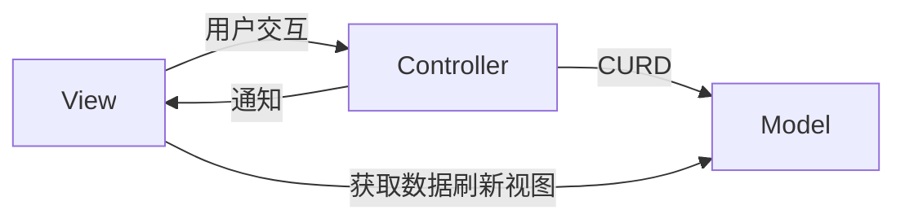
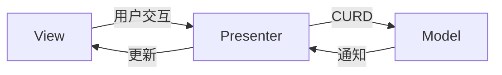

手头有一本《聊聊架构》，最近又找来了《架构之美》囫囵吞枣似的读了一遍，写了些读书笔记，我仅仅是想确切的明白架构是什么。似乎每个程序员都能对架构说上一二，但每个人的说法都不尽相同，即便是那些架构师所说的架构也是如此，当然，对于架构这个词是有定义的，但每个架构师的关注点和视角不一样，所谈论的东西也有很大不同。

多数情况下，架构师这个角色都是由程序员兼任的，尽管这是一个听上去更高阶的角色，但是开发过程总是不可避免涉及某种架构过程，我们总是自嘲自己的工作是“搬砖”，但是在这点上我们跟真正搬砖还是有差异的，软件开发过程允许程序员发挥更大的主观能动性（相对其它大数职业而言），我们总能去创造些精巧的设计去达成业务目的，而搬砖就是真正的搬砖了，这也是为什么写代码这样一件外人看来如此枯燥的事情能够吸引我的原因，而创造是恰好是马斯洛需求层次理论的高阶需求，在代码的世界里它能轻易满足，仅需一台电脑即可。

## 架构是什么？

架构不是一个结果，而是一个过程，我们能够看到很多架构演进，演变的文章，从这点可以知道架构决不是一成不变的，正如软件开发过程更像是植物的生长，而不是砌砖。架构的产出是什么？PPT ？这也是为什么很多架构师被黑，称之为 PPT 架构师的原因了。因为架构的产出往往确实是一张图和一些文档描述，如果这样一张图不能落地能指导实施，那就毫无意义了，或许有忽悠领导汇报的意义。

在我看来，架构设计的目的是实现一个低耦合高内聚的系统，该系统结构要高度有序低熵值，能够避免混乱延缓系统的熵增，甚至能够自发性的维持低熵状态（这意味着我们应该抛开把软件看作某种静态东西的看法，而应把软件想象成一种摄取信息维持生存的生物），因而一个良好的架构能够有效控制系统的复杂度。

谈论架构总是避免不了讨论结构，因为我们第一印象往往想到建筑，架构往往意味着某种“不变的结构”，架构通常由一组结构组成，这些结构的设计目的是为了让架构师、构建者、及其相关利益人能够看到他们的关注点是如何满足的（为什么很多 PPT 架构师能过的挺好的原因），因此架构必须要清晰，并确保得到系统所需求的关注点，我们用的各种设计模式都是为了满足某种关注点。好的架构也因当如同建筑一样具备美、实用、坚固三个特点，并在三者间取得平衡。

从康威定律得到的启示，设计系统的组织反映出组织内部之间的沟通结构，通俗点说，就是组织形式反映系统设计。因而好的的架构设计能够提高组织的效率，正如我在华为所见的，流程与组织的变革往往会引发诸多 IT 变革项目，而这些变革的目的无不是为了提高效率，康威定律反过来是否适用呢？

## 有哪些架构？

随着架构的关注点不同，视角不同会产生不同的架构，诸如业务架构、功能架构、系统架构、技术架构、应用架构、信息架构、安全架构，平台架构，数据架构，流程架构、组织架构等。

不同的关注点和视角，因而其设计要求也不同，甚至编程语言也能影响架构，如 OOP 范式中总是谈论设计模式一样。对程序员而言，我们的视角是从代码出发，接触的多是各种**基于模式的软件架构**，如 MVC、MVVM 这类，当然我们也可以叫他框架，还有分层架构、事件驱动架构等。

我们似乎也不用关注所设计系统的业务架构，流程架构，组织架构之类的，但这些是需要考虑的，它们之间相互影响，一个 IT 系统的架构若是不考虑业务架构那可能无法使用，所以软件架构不能只关注代码。

### MV* 架构

在传统的 GUI 应用中，MV* 是常见的应用架构，MVC、MVP、MVVM 这类架构都包含着同样的内容：

* Models: 对应领域与业务逻辑相关的数据与数据访问层，为计算系统中数据形式的抽象
* Views: 将数据通过某种形式具现的用户界面，能够响应用户输入
* Controller/Presetner/ViewModel: 连接 View 与 Model 的部分，控制 Views 刷新，传递数据给 Models

#### MVC

在经典的 MVC 架构中，Controller 负责响应用户操作、控制模型更新、操作页面渲染，通常在用户与界面产生某些交互后（用户输入，点击等实现）将交互转换为对 Model 的 CURD，然后根据 Models 的变化通知 Views 重渲染 。在这里 Controller 与 Views 是紧耦合的，它需要知道 Views 和 Models 的细节，Controller 在 Models 发生变化后还需要通知 Views 更新，View 亦需要调用 Models 更新数据。

我们期望 Views 和 Models 应该是解耦的，为此我们在 MVC 基础上进行了扩展改进，从而诞生了 MVP。

#### MVP

在这个架构里， presenter 连接 View 与 Model ，**解耦了 View 与 Model**，但是却造成了 Presenter 与 View 和 Model 的强耦合。

#### MVVM

无论是 MVC 还是 MVP，它们的 View 都是包含状态的，View中包含了控制组件的逻辑操作，更进一步我们需要把状态从 View 中剥离出来，就像 React.js 里的函数式组件一样，仅仅依据传入的 props 渲染组件而已。

在将状态从 VIew 中剥离出来后，又如何驱动 View 的更新呢，解决方案是将 ViewModel 与 View 进行数据绑定，View 的更新渲染只依赖 ViewModel 中绑定的数据，View 与 ViewModel 不需要了解彼此的实现细节。

这样一来数据都存在各个分散的 ViewModel 里了，ViewModel 需要保存用户状态数据，需要实现 View 相关的控制逻辑，需要与 Model 交互。这些分散的状态数据显然不利于管理与测试，而且组件与组件之间本身是解耦的，但是涉及通信交互就麻烦了。

#### 数据流驱动

更进一步，我们能否将状态的管理与修改剥离出来放到一个或多个统一的 Store 里，这样 ViewModel 的职责就更单一了。于是乎 Flux 这样的单向数据流驱动的设计就出现了，所有的数据都存在一个或多个 Store 里面，数据的修改都由 Action 触发，通过 Dispatch 分发，然后 Store 根据 Action 改变数据，如果将状态集中式管理在一个 Store 中，那就是 redux 的实现了，单项数据流这样的设计使得整个应用中的数据流变得清晰可预测且可控，进而使得 “时光回溯” 这样的功能变成了可能。

在 MVVM 之后，GUI 来的应用架构变化几乎都属围绕着如何管理状态展开，Mobx，Cycle.js、Rx.js 都对数据流提出了不同的看发和抽象。

## 如何架构？

通常架构的设计除了关注功能性，更关注那些非功能性的，比如性能、安全性、可扩展性、伸缩性、弹性、可用性 等。为了满足这些关注点，架构师通常会定义一些概念并设计结构，如果这个架构能保持概念的完整性，并且满足设计约束，就是好的完美的架构。

**构建抽象屏障是架构的基本方法**，这种方法体现在各种分层架构上，架构设计中设计了各种抽象层，它就像砖块一样垒起来，上层依赖下层，而且这种依赖的方向应该是单向的，不能出现底层依赖上层的情况，并且层与层之间的依赖应该是通过接口来实现而非具体，即依赖倒置原则。

**Clean Architecture** 很好地说明了构建可拓展可测试软件的基本原则

在开始架构前，要闲确定架构的目的与约束，通常我们从事实出发，基于事实得出设计指标，从而确定方案的选型、概念及结构的设计。

----

老实说，我并不具备架构设计的能力与经验背景，因而对于架构我只能浅谈一些理解，但是没有梦想的咸鱼不是好的程序员，所以我因当知道架构是什么，他们做什么，有什么意义和收益，有哪些所谓的架构，了解这些对现在的我已经足够了，剩下的就边学边写啦~